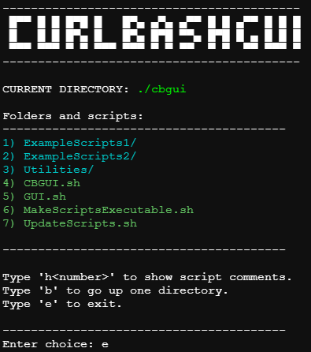

# Curl Bash GUI
Light-weight backbone for Curl | Bash Script Repositories

[](https://github.com/coelacant1/CurlBashGUI/actions/workflows/static.yml)[](https://github.com/coelacant1/CurlBashGUI/actions/workflows/release.yml)

This repository is set up to provide a kickstart to making a curl bash script repository that can access any scripts and navigate through subfolders to describe and execute them. This repository contains helper scripts that contain functions to help keep consistency in displaying user prompts, connecting over ssh, colorizing the text, etc.

Explore the example script website:
[Visit the Demo Scripts Website](https://coelacant1.github.io/CurlBashGUI/)

## Getting Started

These instructions will guide you on how to use this repository as a backbone for your project.

### Prerequisites

- Linux environment (tested on Debian w/ 6.14 kernel)
- Curl, Wget, and Unzip installed

### Single Line Usage

Requires:
```bash
apt update
apt install wget unzip
```

To execute the single line call to navigate all scripts use:
```bash
bash -c "$(wget -qLO - https://github.com/coelacant1/CurlBashGUI/raw/main/CBGUI.sh)"
```

Or an even shorter single line call:
```bash
bash <(curl -L cb.coela.sh)
```


Short single line call with a minimal header:
```bash
bash <(curl -L cb.coela.sh) -nh
```




## Usage

For direct script calls, you may need to call the Utilities.sh script to initialize functions:
```bash
./Utilities.sh
./UpdateScripts.sh
```

Example script showing some functionality:

```bash
#!/bin/bash
#
# _ExampleScript.sh
#
# Demonstrates usage of the included spinner and message functions.
#
# Usage:
#   ./_ExampleScript.sh <text1> <text2>
#
#
# This script simulates a process, updates its status, and then shows success and error messages.
#

source "${UTILITYPATH}/Prompts.sh"

###############################################################################
# Initial Checks
###############################################################################
__check_root__
__install_or_prompt__ "jq"

###############################################################################
# Parse Arguments
###############################################################################
if [ $# -lt 2 ]; then
  echo "Error: Insufficient arguments."
  echo "Usage: ./_ExampleScript.sh <text1> <text2>"
  exit 1
fi

###############################################################################
# MAIN
###############################################################################
__info__ "Simulating an error scenario..."
sleep 2
__err__ "A simulated error has occurred!"

__info__ "Starting a simulated process..."
sleep 2
__update__ "Process is halfway..."
sleep 2
__ok__ "Process completed successfully."
```

## Cloudflare Configuration
Before continuing you will need the following:
- A Cloudflare account
- A domain name available on Cloudflare

Steps to duplicate the set up for the short name for script execution:
- Go to the Cloudflare domain
- Go to DNS
- Add a DNS entry for the A name and point it to an arbitrary IP with the proxy status enabled
- Go to Rules -> Page Rules
- Create a new Page Rule
- Enter the URL (the DNS entry you made earlier, i.e. if it was cb on .coela.dev, then it will be cb.coela.sh/)
- Pick a setting -> Forwarding URL
- Select a status code -> 301 Permanent Redirect
- For the URL, go to the modified calling script (in this repo it is CBGUI.sh), then right click Raw and copy the link address, use this as the URL. For this repository it is the following:
```
https://github.com/coelacant1/CurlBashGUI/raw/refs/heads/main/CBGUI.sh
```
- Click save
- Test by going to your specified domain name directly, i.e. cb.coela.sh and see if it redirects to the Raw script content
- Test on a Linux system with:
```bash
bash <(curl -L cb.coela.sh) -nh
```

## GitHub Configuration
To utilize the release functionality of this repository, you need to follow these steps:
- Go to the new or forked repository
- Go to Settings
- Go to Actions -> General
- Set Workflow Permissions to: Read and write permissions
- Click the checkbox to allow GitHub Actions to create pull requests or submit approving pull request reviews.

## Contributing

If you would like to add or improve this repository, please follow these steps:

- Fork the repository on GitHub.
- Commit your changes (git commit -m 'Add some YourFeature').
- Push to the branch (git push origin main).
- Submit a pull request through the GitHub website.

## Support

For support, please open an issue in the GitHub repository or contact the maintainers.
